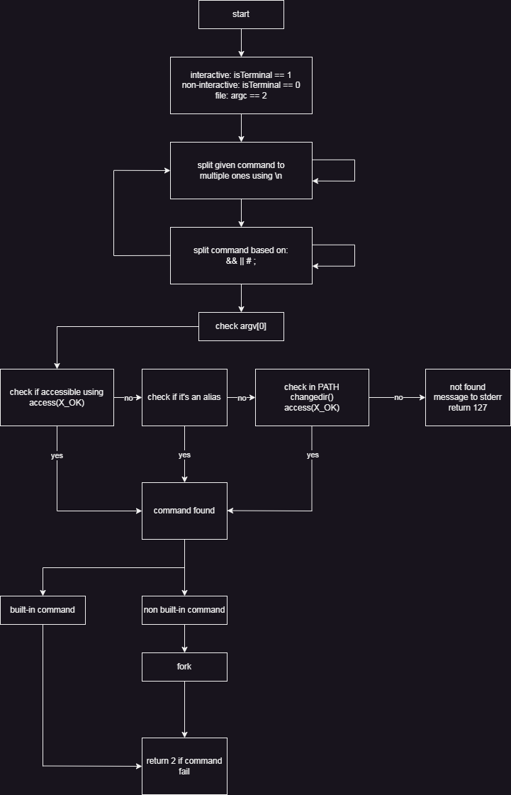

## simple shell project (ALX)
This repository contains the source code of the simple_shell project of ALX school. This is nowhere that good code, but it gets the job done.

If you are in ALX, then please do not copy any code as you might get flagged for cheating.

## How the shell deal with the input
The first thing the shell does is to detect from where it will take the inputs, either from a file (if argc == 2) or from standard input.

The shell is expected to receive multiple line commands, the first thing it will do is to separate the lines from each other.

example like:
echo "cd / && ls
ls -l" | ./shell
will separate "cd / && ls" from "ls -l"

After that, it will cut each line into sections (probably not the correct word, but still makes sense) based on ["&&", "||", ";", "#"], _strtok for the job. for example "cd / && ls" will get cut into 2 commands: "cd /" and "ls".

## How the shell searches for the commands
The shell will look for the command in the following order:
1. Checks if the command is an alias (not an alias outside of the program). If found, the alias's value will be replaced with the command.
2. Checks if the command is an executable path (like /usr/bin/ls), if the command has slashes, then this is the only step performed, else the command is not found. If found, the command will be executed in a new process. Else;
3. Checks if the command is a shell built-in (exit, env, setenv, unsetenv, cd, alias), execute it without making a new process. If not, then;
4. Checks if the command is in PATH, environ must not be NULL. If found, the path of the command will be passed to execve after making a new process. If not, then;
5. Command is not found.

## Constraints
The shell doesn't support (yet) most basic features, like:
- redirection ("<",">")
- quotation marks (" and ')
- pipes (|)
- ...etc
